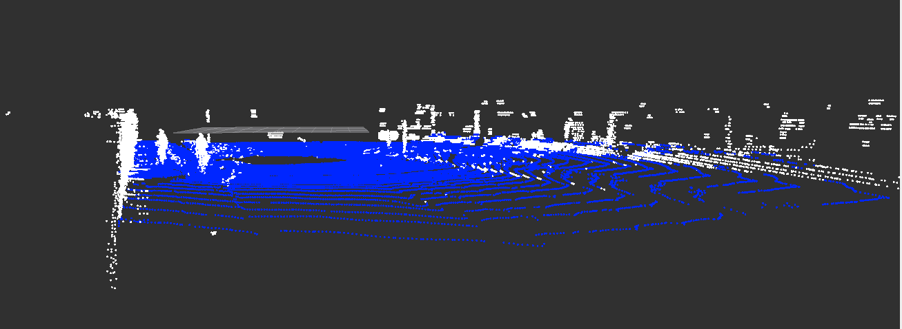
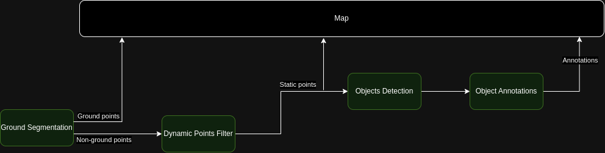

# Summary

Ground segmentation in pointcloud data is the process of separating the points into ground and non-ground. It is a binary classification problem and many approaches have been published in literature. One approach to ground segmentation is to subdivide a large pointcloud into smaller cells and analyze each cell by fitting a model. It is common practice to fit a planar model to the points. Although the existing solutions produce good results in certain scenarios based on certain assumptions about the robot environment, yet there is no solution which provides a general purpose solution for outdoor applications in mobile robotics. In this work, we provide such a solution for rough terrain indoor and outdoor mobile robot applications. 

<figure>
  
  <figcaption>Figure 1: Basic principle of the ground segmentation task [6].</figcaption>
</figure>

<figure>
  
  <figcaption>Figure 2: Proposed solution on KITTI dataset for road surface detection. White (non-ground points), Blue(ground points)</figcaption>
</figure>

# Statement of need

- Detection of ground points is a necessary precursor step for extraction of useful information from pointcloud data for downstream tasks in mobile robot navigation [6,8]
- Object and obstacle detection algorithms detect ground points as false positives. The detection can be improved when ground points are
detected and removed. Additionally, the computational burden is reduced by processing only non-ground points [9].
- Ground points can be used for traversability analysis, navigation, and static map generation.

<figure>
  
  <figcaption>Figure 3: Standard pipeline for processing of pointcloud data for robot navigation</figcaption>
</figure>

# State of the Art
The extraction of ground points from a pointcloud sample is a key step in the perception pipleine of an autonomous systems. There are a number of solutions which have been presented over the past few years.

Our main for this work was to focus on extraction of ground points with as few fixed thresholds as possible. We wanted to extract the ground points without the need to tune parameters to adapt to indoor and outdoor scenarios. Although our approach is not free of parameter tuning for best performance, however, we feel that the parameters only need to be tuned if the robot environment has major changes. 

We chose a model fitting approach for our solution because once broken down to smaller cells, it is a plausible to assume that the local cells are flat given that the cell size is very small. The smaller cell size ensures that the assumption holds more often than not but this increases the computation cost due to the increased number of cells in the grid. A large grid cell size improves performance and produces good results in indoor or autonomous driving scenario but flattens the natural curvature of ground in outdoor environments. Large grid size in highly uneven terrain produces poor results and this is to be expected because the planar model fit will ignore some points. What do we do with the points which were marked as outliers but are not really outliers?

Another challenge with the grid representation is that based on the sparsity of points, we might have completely different point assignment to a grid cell. In one cell, we might have a line of points, in another, a few lines, and in some one of a few randomly scattered points.

# Challenges

## Grid cell size vs roughness of the terrain

In principle, small grid cells are better suited for plane fitting algorithms but the size of grid cell has a direct impact on the computational performance of the algorithm. The selected size also depends on the gap of the scan lines. The scan lines in close proximity to the robot are dense and the distance between the lines increases based on the distance from the robot. Irrespective of the grid cell size, a cell close to the robot is more likely to have points from multiple scan lines assigned to it. This means that such cells are better suited to fit a plane model. As a concequence, it is possible to have an accurate slope estimate of the local point surface. On the contrary, cells which are assigned points far away from the robot are more likely to have only single scan lines assigned to them. A plane fitting algorithm can fit a plane to the line of points but the slope estimate is highly uncertain and is usually unreliable.

Additionally, the size of the grid cells is also closely related to the type of application and environment. In indoor environments with flat surfaces, it is generally unproblamatic to have large grid cell size as compared to outdoor uneven terrain. To sum up, there is so one size fits all solution when it comes to selection of a suitable grid cell size for a ground segmentation algorithm.

In our solution, we make use of the known and reliable information and tried to find an algorithm which solves most of previously mentioned challenges. One challenge which remains unsolved is the computational performance related to the grid cell size. The type and amount of computational power available is robot platform dependent and therefore the grid cell size is coupled to the available resources. The user should select a grid cell size based on the runtime requirements of the algorithm.

## Sparse assignment of far off points to grid cells

As mentioned earlier, the point assignment to grid cells is non uniform and depends on various factors. It is not feasible to blindly fit a plane to all grid cells because some cells may have a single line of points or a random distribution of points. This is especially the case when using a fixed grid size and the distance of the cell from the pointcloud origin increases.

## Polar vs Square grid cells

Literature review has shown that researchers prefer polar grid cells as compared to square cells. However, in our experiments we found a square grid cell with a fixed grid size performs better than polar cells. The reason in our view is that as the distance from the sensor origin increases, the cells get bigger and as a concequence, results in the deterioration of the performance of the plane fitting based segmentation 

## False positive flat surfaces other than ground e.g. table top, car roof etc.

The gradient of the fitting plane to a grid cell can not be used as the sole criteria for the segmentation. The reason is the existence of flat surfaced obstacles in the robot's environment.

## False positive points at the junction of ground and obstacles
We perform a point wise check to remove as many false positives as possible at the junction of ground and non-ground points

## Influence of grid cell height on the performance of segementation

## Outlier Correction
The plane fitting will produce false positive outliers because of the natual curvature of the ground surface. A correction step using the actual 
resultant normal of the points is used to correctly assign ground and non ground points.

## Performance

# Core Components

## Pre Processing

The input pointcloud is first filtered to a user defined region.

## 3D Grid Representation
The points are at first subdivided into a euclidean space 3d grid.

## Local Eigen Analysis

Points in each grid cell are analyzed based on the ratio of eigen values. Based on the ratio of the largest eigen value with the sum of all eigne values,
we can rougly estimate that spread of points in the grid cell.

1) Ratio > 0.950
If the largest eigen value is also the dominating value in all the values then we classify this set
of points as a LINE.

2) Ratio > 0.40
If the ratio is > 0.4 then the points are classified as PLANE

3) Ratio < 0.40
If the ratio is < 0.40 then the points are classified as UNKNOWn

This step is important because as the distance of points gets large the point assignment to gird cells gets sparse. The plane fitting step is not suitable the case the points are LINE because the resulting plane fit can take any orientation and this will reduce the quality of segmentation. Similarly for UNKNOWN cells, we can not be certain if the points are from uneven terrain, vegetation etc. and thus the plane fit will not be of high quality.

We can safely perform plane fitting on cells with the PLANE classification and can trust the resulting slope for the initial corse estimation of ground and non-ground cells.

The cells are classified into three categories: PLANE, LINE, UNKNOWn

## Planar Model Fitting

The PLANE cells from the previous step are fitted with a plane model 
The LINE cells are analyzed 
The cells which fulfill the ground criteria are tentatively marked as a potential ground cells.
Cells which fit the ground criteria are used to select the initial seeds for region growing.
The initial seed cells are the ones which are closest to the mean height of all tentative ground cells and with highest number of ground neighbors.
Cells which do not fit the ground criteria are marked as non-ground

## Seed Selectiom

The seed cells are selected based on the following conditions:
1) High confidence of the cell points belong to ground
2) The centroid is within a user defined distance threshold
3) Initial cells are ground into 4 groups of cells, each group belongs to a single quadrant
4) Mean height is computed for each group
5) Seed cells are selected in each quadrant based on neighborhood and closeness to the mean height. The cell with the most ground neighbors and closest to the mean height is selected as a seed each from each quadrant.
6) At the end of seed selection, we have 1 seed cell selected from each quadrant.

## Region Growing
The initial seed cells are used to grow the ground cells. All ground neighbors are expanded recursively. 

## Segmentation

### Ground Cells

The ground cells are the result of the expansion of the grid. The grid expansion is based on connectivity of ground cells, thus any falsely classified ground cells which merely fulfilled the slope criteria are rejected during expansion because there was no connectivity of such a cell to main body of the ground cells.

After the region growing, we go over all the cells marked as ground and segment each cell's points into inliers and outliers. The segmentation uses the inliers from the plane fitting. The goal here is to detect small obstacles in the ground cells. Given that the real world ground has curvature, we are certain that the plane fit did indeed mark some ground points as outliers and they will be falsely assigned to non-ground points, resulting in poor quality of segmentation in very uneven terrain. 

Outlier check:
1) Find the closest inlier point and compute the vector from the inlier to outlier
2) Compute the distance of vector's component along the ground normal
3) If the distance along the normal is 
   3.1) less than or equal to the plane fit threshold then the outlier is marked as ground point  
   3.2) greator than the plane fit theshold then the outlier marked as non-ground point

### Unknown Cells

At this step, it is still not known whether the unknown cells are ground or non-ground. To solve this, we use the ground points from the previous step and compute the normals for all the points. Afterwards, we use the same algorithm used for the outlier check in the previous step to classify each unknown point as either ground or non-ground. It is not necessary that the cloest ground point to an unknown point belong to the same or neighboring cells. The distance along the normal can only be used when the points are close to each other. To avoid far off unknown points from being falsly classified, we make sure that the distance between the unknown and the ground point is within a user-defined threshold.

### Non-Ground Cells

Over segmentation of non-ground cells is very evident in the case of non-ground cells. We process each non-ground cell based on its neighborhood.

1) If the non-ground cell has no ground neighbors then we can safely assign all the points as non-ground.
2) If the non-ground cell has ground neighbors then we need to make sure which of these ground neighbors are actually ground and which were falsely assigned the ground label due to only slope criteria fulfillment.
3) To confirm the genuine ground neighbors, we explore its neighborhood via neighborhood expansion and the cell has a connectivity to 50% of the total ground cells, then we can be certain that this ground cell belongs to the main body of ground cells. Less than the threshold will mean that the cell might be false positive ground cell and not taken into consideration for the next step.
4) If the non-ground cell has ground neighbors belonging to the main body of the ground cells then we collect all ground points into a single collection of points
5) Afterwards, we use the asme algorithm used in outlier check to classify segment ground and non-ground points.

# Two Step Approach
Two phase segmentation of points based on local surface properties and neighbourhood analysis 

First phase uses a large height for the grid cells.
The large grid cell in the z direction ensures that we capture as many obstacles are possible. However, this also means that ground points in cases of the tree canopy will be falsly classified as non-ground points. We cater for these false detections at the later stage.

Second phase uses a small height for the grid cells.

The second phase uses a smaller grid cell height so that we can remove any false positive detections of ground points. All the false positive detections are later added back to the non-ground points during the post processing phase.

## Post Processing

## 3D Convex Hull Correction

# Current Capabilities and applications 

- Capability1
- Capability2
- Capability3

# Outlook and future work 

- How to handle soft obstacles like tall grass and plants?
- How to tune the parameters automatically based on local region properties?
- 

# Acknowledgements 

# References
