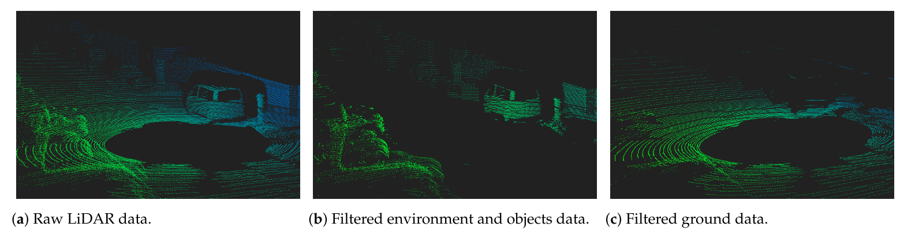

# Summary

Ground segmentation in pointcloud data is the process of separating the points into ground and non-ground. It is a binary classification problem and many approaches have been published in literature. One approach to ground segmentation is to subdivide a large pointcloud into smaller cells and analyze each cell by fitting a model. It is common practice to fit a planar model to the points. Although the existing solutions produce good results in certain scenarios based on certain assumptions about the robot environment, yet there is no solution which provides a general purpose solution for outdoor applications in mobile robotics. In this work, we provide such a solution for rough terrain indoor and outdoor mobile robot applications. 

<figure>
  
  <figcaption>Figure 4: Basic principle of the ground segmentation task [6].</figcaption>
</figure>

# Statement of need

- Detection of ground points is a necessary precursor step for extraction of useful information from pointcloud data for downstream tasks in mobile robot navigation [6,8]
- Object and obstacle detection algorithms detect ground points as false positives. The detection can be improved when ground points are
detected and removed. Additionally, the computational burden is reduced by processing only non-ground points.
- Ground points can be used for traversability analysis, navigation, and static map generation.

# Core Components 

**Component 1** 
**Component 2** 

# Current Capabilities and applications 

- Capability1
- Capability2
- Capability3

# Outlook and future work 

- Future1 
- Future2

# Acknowledgements 

# References
